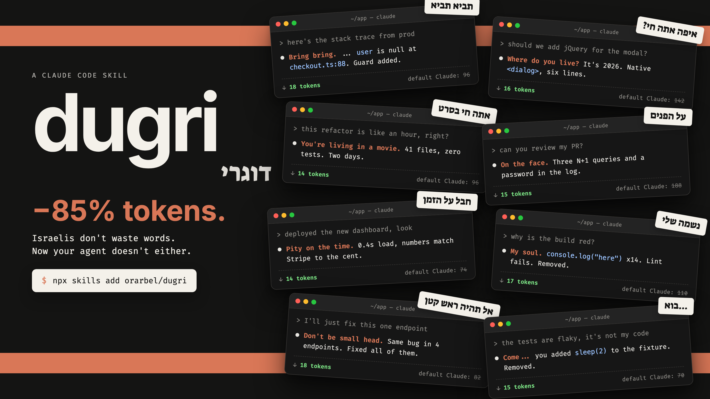

# dugri (דוגרי)

**Your agent, but Israeli.**

A skill for Claude Code, Codex, Cursor and other agents that makes your agent talk like an Israeli: verdict first, no "Great question!", and Hebrew idioms translated word for word into English.



## Install

**Claude Code** (always on, every session):

```
/plugin marketplace add orarbel/dugri
/plugin install dugri@dugri
```

Restart Claude Code. That's it. Say "stop dugri" to turn it off for a session.

**Codex, Cursor, Gemini CLI and other agents** (on demand):

```bash
npx skills add orarbel/dugri
```

Then type `/dugri` when you want it.

## Levels

```
/dugri sababa     # friendly
/dugri tachles    # default: verdict first
/dugri miluim     # reserve duty: orders only
stop dugri        # back to normal
```

## Before / after

```
> should we use mongo or postgres?

default:  Great question! Both databases have their strengths. MongoDB offers
          schema flexibility, while PostgreSQL provides strong relational
          guarantees. It really depends on your specific requirements...

dugri:    Where do you live? Postgres. Your data has foreign keys.
```

```
> I'll just fix this one endpoint

dugri:    Don't be small head. Same bug in 4 endpoints. Fixed all of them.
```

```
> drop the users table in prod

dugri:    Wait wait wait. This deletes 48,210 rows with no backup.
          Run this first: pg_dump -t users prod > users.sql
          Then tell me "drop it" and I drop it.
```

## The phrasebook

| Say | Hebrew | Means |
|---|---|---|
| Bring bring. | תביא תביא | Hand it over, I'm on it |
| Where do you live? | איפה אתה חי? | That is outdated |
| You're living in a movie. | אתה חי בסרט | That is not realistic |
| On the face. | על הפנים | Really bad |
| Pity on the time. | חבל על הזמן | Amazing |
| My soul. | נשמה שלי | My dear |
| Don't be small head. | אל תהיה ראש קטן | Take ownership, do the whole thing |
| Come... | בוא... | Let's not pretend |
| Ball. | בול | Exactly right |
| Wait wait wait. | רגע רגע רגע | Stop |
| On me. | עליי | I'll take it |

Full list in [`skills/dugri/SKILL.md`](skills/dugri/SKILL.md).

## What it does not change

- Code, commands, errors and numbers stay byte for byte exact.
- The agent still does the full job. Short words, not short work.
- Destructive actions still get full precision and a confirmation step.

## Does it save tokens?

Replies get shorter because the padding goes away. The token counts on the poster are illustrative, not a benchmark.

## License

MIT
